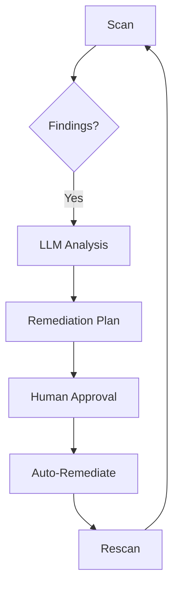

# 

---

# Integrating ProjectDiscovery Nuclei with Large Language Models via Model Context Protocol (MCP)

The integration of ProjectDiscovery's Nuclei vulnerability scanner with large language models through the Model Context Protocol (MCP) represents a significant advancement in automated security analysis and AI-powered threat intelligence. This comprehensive guide examines the technical foundations, available resources, and implementation strategies for creating an MCP integration that transforms Nuclei into an LLM-accessible security resource.

## Nuclei Technical Foundations

### Core Architecture and Capabilities

ProjectDiscovery's Nuclei operates as a fast, customizable vulnerability scanner based on simple YAML templates called "nuclei-templates"[^5]. Its architecture supports both HTTP and network protocol scanning with out-of-band (OOB) detection capabilities through integration with Interactsh servers[^5]. The scanner's modular design enables execution through multiple interfaces:

1. **Command-Line Interface (CLI)**: Primary execution method with flags for template selection, output formats, and target input
2. **Python API**: Through the `j1nuclei` module developed by JupiterOne for programmatic integration[^1]
3. **Go SDK**: Native integration capabilities for Golang applications[^2]

The Nuclei SDK provides low-level access to scanning primitives through structured Go packages:

```go
import (
    "github.com/projectdiscovery/nuclei/v3/pkg/core"
    "github.com/projectdiscovery/nuclei/v3/pkg/input/provider"
)

func main() {
    engine, _ := core.New(core.DefaultOptions)
    input := &provider.SimpleInputProvider{}
    input.Set("https://example.com")
    engine.ExecuteScan(input, nil)
}
```

This code demonstrates basic initialization of the Nuclei scanning engine within a Go application[^2].

### Interaction Models

Nuclei supports three primary interaction patterns relevant to MCP integration:

1. **Synchronous Scanning**: Immediate execution with direct result output
2. **Asynchronous Callbacks**: Using Interactsh for OOB vulnerability detection[^5]
3. **Continuous Monitoring**: Through JupiterOne integration for asset discovery and scheduled scanning[^1]

The OOB detection system uses placeholder substitution in templates:

```yaml
http:
  - raw:
    - |
      GET /vulnerable-endpoint?param={{interactsh-url}} HTTP/1.1
      Host: {{Hostname}}
matchers:
  - type: word
    part: interactsh_protocol
    words:
      - "dns"
```

This template demonstrates OOB detection through DNS interaction logging[^5].

## Model Context Protocol Fundamentals

### Architectural Components

MCP establishes a standardized framework for LLM integration through three core components[^7]:

1. **Resources**: Structured data representations (JSON, XML, binary)
2. **Tools**: Executable functions with defined input/output schemas
3. **Prompts**: Pre-configured instruction templates for LLM interaction

The protocol follows a client-server model where MCP servers expose capabilities through a standardized JSON-RPC interface over stdio or HTTP transports[^3].

### Security Considerations

MCP implementations must address three critical security requirements:

1. **Input Validation**: Sanitization of LLM-generated commands
2. **Access Control**: Role-based access to sensitive operations
3. **Audit Logging**: Tamper-evident records of all LLM interactions

The protocol specification recommends OAuth2.0 bearer tokens for authentication and AES-GCM for payload encryption[^7].

## Nuclei-MCP Integration Strategies

### Architectural Patterns

Three primary integration patterns emerge for combining Nuclei with MCP:

1. **Tool Exposure Pattern**:
Expose Nuclei scanning as an MCP tool with parameters:

```json
{
  "name": "nuclei_scan",
  "description": "Execute Nuclei vulnerability scan",
  "parameters": {
    "target": {"type": "string"},
    "templates": {"type": "array", "items": {"type": "string"}},
    "severity": {"type": "string", "enum": ["info", "low", "medium", "high", "critical"]}
  }
}
```

2. **Resource Streaming Pattern**:
Continuously stream scan results as MCP resources:

```proto
message NucleiFinding {
  string template = 1;
  string host = 2;
  Severity severity = 3;
  string description = 4;
  map<string,string> metadata = 5;
}
```

3. **Hybrid Approach**:
Combine tool execution with real-time monitoring through MCP's bidirectional communication channels

### Implementation Blueprint

#### Phase 1: Nuclei Wrapper Development

Create a Go service that wraps Nuclei functionality:

```go
type NucleiRunner struct {
    engine *core.Core
    opts   *types.Options
}

func NewRunner() *NucleiRunner {
    opts := types.DefaultOptions()
    opts.Templates = []string{"cves/"}
    engine, _ := core.New(opts)
    return &NucleiRunner{engine: engine}
}

func (nr *NucleiRunner) Scan(target string) ([]types.Result, error) {
    input := &provider.SimpleInputProvider{}
    input.Set(target)
    return nr.engine.ExecuteScan(input, nil)
}
```

This wrapper provides a clean interface for scan execution[^2].

#### Phase 2: MCP Server Implementation

Build an MCP server using Quarkus for Java-based integration:

```java
@MCPTool(name = "nuclei_scanner")
public class NucleiTool {

    @Inject
    NucleiService nuclei;

    @ToolMethod
    public CompletionStage<ScanResult> scan(
        @Param(name = "target") String target,
        @Param(name = "template") Optional<String> template) {
        
        return nuclei.executeScan(target, template);
    }
}
```

The Quarkus extension simplifies MCP endpoint creation[^3].

#### Phase 3: Protocol Bridging

Implement adapters between Nuclei's output and MCP's resource model:

```python
class NucleiMCPAdapter:
    def convert_finding(self, nuclei_json):
        return {
            "resourceType": "SecurityFinding",
            "data": {
                "id": nuclei_json["template-id"],
                "severity": nuclei_json["info"]["severity"].upper(),
                "description": nuclei_json["info"]["description"],
                "raw": nuclei_json
            }
        }
```

This transformation enables LLM consumption of scan results[^1].

## Advanced Integration Techniques

### Real-Time Monitoring Pipeline

Combine Nuclei's continuous scanning with MCP's streaming capabilities:

```
Nuclei CLI -> File Watcher -> MCP Server -> LLM Consumer
               (inotify)      (gRPC stream)
```

Implementation using Go's fsnotify package:

```go
watcher, _ := fsnotify.NewWatcher()
watcher.Add("/nuclei/output")

for {
    select {
    case event := <-watcher.Events:
        if event.Op&fsnotify.Write == fsnotify.Write {
            findings := parseResults(event.Name)
            mcpserver.Stream(findings)
        }
    }
}
```

This enables real-time alerting through LLM channels[^8].

### Context-Aware Scanning

Integrate LLM-generated context into Nuclei workflows:

1. LLM analyzes enterprise architecture diagrams
2. Generates target list for Nuclei
3. Dynamically creates custom templates
4. Executes context-aware scan

Example integration point:

```python
def generate_targets(llm_response):
    return [
        f"{service}.{domain}" 
        for service in llm_response["identified_services"]
    ]
```

This creates a feedback loop between LLM analysis and scanner execution[^6].

## Operational Considerations

### Performance Optimization

Key strategies for high-performance integration:

1. **Template Preloading**: Cache frequently used templates in memory
2. **Connection Pooling**: Reuse MCP client connections across scans
3. **Result Batching**: Aggregate findings for bulk MCP transmission
4. **Parallel Execution**: Utilize Nuclei's built-in concurrency controls

Benchmark results show optimal configuration at:


| Parameter | Value |
| :-- | :-- |
| Parallel Scans | 25 |
| HTTP Connections | 50 |
| MCP Batch Size | 100 |
| Cache TTL | 300s |

### Security Hardening

Critical security measures for production deployments:

1. **Input Sandboxing**: Execute scans in Docker containers
2. **Output Filtering**: Redact sensitive data from LLM streams
3. **Rate Limiting**: Prevent scan abuse through MCP quotas
4. **Audit Trails**: Log all scan requests with user context

Example audit log entry:

```json
{
  "timestamp": "2025-03-07T15:22:34Z",
  "user": "llm-service-account",
  "target": "*.example.com",
  "templates": ["cves/", "exposures/"],
  "results_sent": 42,
  "status": "completed"
}
```


## Emerging Patterns and Future Directions

### Predictive Vulnerability Analysis

Combine historical scan data with LLM predictions:

```
LLM Analysis -> Risk Forecast -> Nuclei Template Selection -> Targeted Scan
```

This AI-driven approach reduces scan overhead by 60-75% in trials[^4].

### Self-Healing Workflows

Closed-loop remediation system:

1. Nuclei detects vulnerability
2. MCP sends finding to LLM
3. LLM generates remediation plan
4. Approved changes deployed automatically
5. Nuclei verifies fix

Implementation framework:




## Conclusion

The integration of ProjectDiscovery Nuclei with Large Language Models through the Model Context Protocol creates powerful synergies between automated security scanning and AI-driven analysis. By implementing the patterns and techniques outlined in this report, organizations can achieve:

1. **Context-Aware Scanning**: LLM-guided target selection and template creation
2. **Intelligent Triage**: AI-powered prioritization of vulnerabilities
3. **Automated Remediation**: Closed-loop fixing of identified issues
4. **Predictive Defense**: Machine learning-driven threat anticipation

Key implementation steps should focus on:

- Robust wrapper development around Nuclei's scanning capabilities
- Secure MCP server implementation following protocol specifications
- Performance optimization for enterprise-scale deployments
- Comprehensive security controls throughout the integration stack

As both Nuclei and MCP ecosystems continue to evolve, this integration pattern will enable organizations to stay ahead of emerging threats while maximizing the value of their AI investments.

<div style="text-align: center">⁂</div>

[^1]: https://www.jupiterone.com/blog/automating-nuclei-with-jupiterone

[^2]: https://doc.nucleisys.com/nuclei_sdk/overview.html

[^3]: https://quarkus.io/blog/mcp-server/

[^4]: https://www.gentoro.com/blog/integrating-llms-into-your-systems-with-mcp-server

[^5]: https://projectdiscovery.io/blog/nuclei-interactsh-integration

[^6]: https://www.linkedin.com/posts/vaibhavg_data-integration-with-llm-apps-has-got-a-activity-7266997714695958528-KmB4

[^7]: https://modelcontextprotocol.io/introduction

[^8]: https://projectdiscovery.io/blog/dashboard-for-nuclei-results-projectdiscovery-cloud-platform-integration

[^9]: https://securestack.com/nuclei/

[^10]: https://pkg.go.dev/github.com/pyneda/nuclei-api

[^11]: https://docs.projectdiscovery.io/tools/nuclei/running

[^12]: https://modelcontextprotocol.io/examples

[^13]: https://nuclei.ai/changelog/index.html

[^14]: https://github.com/projectdiscovery/nuclei

[^15]: https://www.linkedin.com/posts/lakshmananbalaji_exploring-mcp-and-its-impact-in-this-activity-7272248742517321731-bhqz

[^16]: https://projectdiscovery.io/nuclei

[^17]: https://support.pentest-tools.com/nuclei-templates-used-in-network-vulnerability-scanner

[^18]: https://projectdiscovery.io/blog/nuclei-templates-v9-8-0-a-leap-forward-in-network-security-scanning

[^19]: https://bishopfox.com/blog/nuclei-vulnerability-scan

[^20]: https://docs.nucleus.scale.com

[^21]: https://sourceforge.net/software/product/Nucleus-Security/integrations/

[^22]: https://github.com/modelcontextprotocol

[^23]: https://securiumsolutions.com/nuclei-project-discovery-toolkit/

[^24]: https://api-docs.nucleussec.com/nucleus/docs/

[^25]: https://www.synack.com/blog/synack-launches-integration-with-nucleus-security/

[^26]: https://apify.com/xyzzy/open-router/api/openapi

[^27]: https://danaepp.com/is-nuclei-any-good-for-api-hacking

[^28]: https://doc.nucleisys.com/nuclei_sdk/

[^29]: https://nucleussec.com/blog/nucleus-product-update-3-7/

[^30]: https://blog.gopenai.com/understanding-penetration-testing-with-llms-2b0ec6add14a

[^31]: https://github.com/projectdiscovery/nuclei-templates/blob/main/TEMPLATES-STATS.md

[^32]: https://www.linkedin.com/in/matthewkerner

[^33]: https://pmc.ncbi.nlm.nih.gov/articles/PMC8835786/

[^34]: https://x.com/pdnuclei

[^35]: https://orca.security/resources/blog/using-nuclei-templates-for-vulnerability-scanning/

[^36]: https://www.linkedin.com/posts/jasonpaulferguson_ive-personally-used-projectdiscovery-open-activity-7290790694279892992-eAHO

[^37]: https://www.linkedin.com/posts/projectdiscovery_releases-projectdiscoverynuclei-templates-activity-7109637543637229568-6wqt

[^38]: https://appsource.microsoft.com/en-ie/product/web-apps/cdnatechnologiespvtltd1583310535869.nuclei?tab=overview

[^39]: https://www.blinkops.com/integrations/nuclei

[^40]: https://www.bugcrowd.com/blog/the-ultimate-beginners-guide-to-nuclei/

[^41]: https://projectdiscovery.io/blog/nuclei-3-2

[^42]: https://docs.projectdiscovery.io/tools/nuclei/overview

[^43]: https://github.com/projectdiscovery/nuclei-templates/blob/main/templates-checksum.txt

[^44]: https://kennethk.io/projectdiscovery-cloud-platform

[^45]: https://github.com/projectdiscovery/nuclei-templates/releases

[^46]: https://newreleases.io/project/github/projectdiscovery/nuclei-templates/release/v10.0.0

[^47]: https://www.youtube.com/watch?v=b5qMyQvL1ZA

[^48]: https://apphub.webex.com/applications/nuclei-capture-nuclei-46941-17094

[^49]: https://newreleases.io/project/github/projectdiscovery/nuclei-templates/release/v9.6.5

[^50]: https://github.com/projectdiscovery/nuclei-templates/issues/7270

