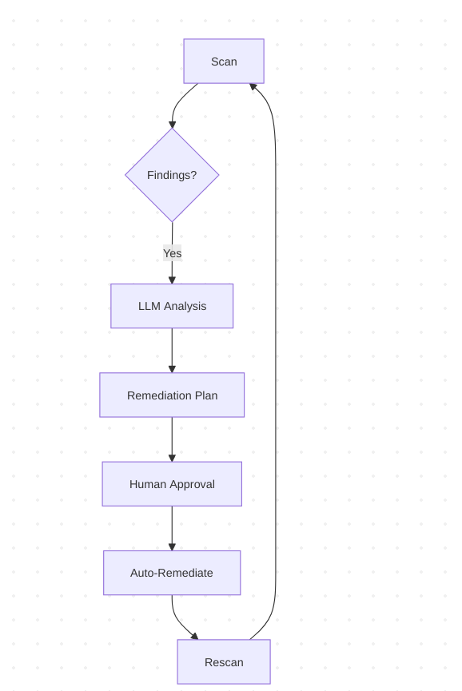

# Integrating ProjectDiscovery Nuclei with Large Language Models via Model Context Protocol (MCP)

The integration of ProjectDiscovery's Nuclei vulnerability scanner with large language models through the Model Context Protocol (MCP) represents a significant advancement in automated security analysis and AI-powered threat intelligence. This comprehensive guide examines the technical foundations, available resources, and implementation strategies for creating an MCP integration that transforms Nuclei into an LLM-accessible security resource.

## Nuclei Technical Foundations

### Core Architecture and Capabilities

ProjectDiscovery's Nuclei operates as a fast, customizable vulnerability scanner based on simple YAML templates called "nuclei-templates"[^5]. Its architecture supports both HTTP and network protocol scanning with out-of-band (OOB) detection capabilities through integration with Interactsh servers[^5]. The scanner's modular design enables execution through multiple interfaces:

1. **Command-Line Interface (CLI)**: Primary execution method with flags for template selection, output formats, and target input
2. **Python API**: Through the `j1nuclei` module developed by JupiterOne for programmatic integration[^1]
3. **Go SDK**: Native integration capabilities for Golang applications[^2]

The Nuclei SDK provides low-level access to scanning primitives through structured Go packages:


### Interaction Models

Nuclei supports three primary interaction patterns relevant to MCP integration:

1. **Synchronous Scanning**: Immediate execution with direct result output
2. **Asynchronous Callbacks**: Using Interactsh for OOB vulnerability detection[^5]
3. **Continuous Monitoring**: Through JupiterOne integration for asset discovery and scheduled scanning[^1]

The OOB detection system uses placeholder substitution in templates:

```yaml
http:
  - raw:
    - |
      GET /vulnerable-endpoint?param={{interactsh-url}} HTTP/1.1
      Host: {{Hostname}}
matchers:
  - type: word
    part: interactsh_protocol
    words:
      - "dns"
```

This template demonstrates OOB detection through DNS interaction logging[^5].

## Model Context Protocol Fundamentals

### Architectural Components

MCP establishes a standardized framework for LLM integration through three core components[^7]:

1. **Resources**: Structured data representations (JSON, XML, binary)
2. **Tools**: Executable functions with defined input/output schemas
3. **Prompts**: Pre-configured instruction templates for LLM interaction

The protocol follows a client-server model where MCP servers expose capabilities through a standardized JSON-RPC interface over stdio or HTTP transports[^3].

### Security Considerations

MCP implementations must address three critical security requirements:

1. **Input Validation**: Sanitization of LLM-generated commands
2. **Access Control**: Role-based access to sensitive operations
3. **Audit Logging**: Tamper-evident records of all LLM interactions

The protocol specification recommends OAuth2.0 bearer tokens for authentication and AES-GCM for payload encryption[^7].

## Nuclei-MCP Integration Strategies

### Architectural Patterns

Three primary integration patterns emerge for combining Nuclei with MCP:

1. **Tool Exposure Pattern**:
Expose Nuclei scanning as an MCP tool with parameters:

```json
{
  "name": "nuclei_scan",
  "description": "Execute Nuclei vulnerability scan",
  "parameters": {
    "target": {"type": "string"},
    "templates": {"type": "array", "items": {"type": "string"}},
    "severity": {"type": "string", "enum": ["info", "low", "medium", "high", "critical"]}
  }
}
```

2. **Resource Streaming Pattern**:
Continuously stream scan results as MCP resources:

```proto
message NucleiFinding {
  string template = 1;
  string host = 2;
  Severity severity = 3;
  string description = 4;
  map<string,string> metadata = 5;
}
```

3. **Hybrid Approach**:
Combine tool execution with real-time monitoring through MCP's bidirectional communication channels

### Implementation Blueprint

#### Phase 1: Nuclei Wrapper Development

Create a Go service that wraps Nuclei functionality and reimplements the Nuclei go package to provide a simple interface for scan execution.


```go
type NucleiRunner struct {
    engine *core.Core
    opts   *types.Options
}

func NewRunner() *NucleiRunner {
    opts := types.DefaultOptions()
    opts.Templates = []string{"cves/"}
    engine, _ := core.New(opts)
    return &NucleiRunner{engine: engine}
}

func (nr *NucleiRunner) Scan(target string) ([]types.Result, error) {
    input := &provider.SimpleInputProvider{}
    input.Set(target)
    return nr.engine.ExecuteScan(input, nil)
}
```

This wrapper provides a clean interface for scan execution[^2].

#### Phase 2: MCP Server Implementation

Build an MCP server using the Mark3 Labs MCP Go library:

### Context-Aware Scanning

Integrate LLM-generated context into Nuclei workflows:

1. LLM analyzes enterprise architecture diagrams
2. Generates target list for Nuclei
3. Dynamically creates custom templates
4. Executes context-aware scan

Example integration point:

```python
def generate_targets(llm_response):
    return [
        f"{service}.{domain}" 
        for service in llm_response["identified_services"]
    ]
```

This creates a feedback loop between LLM analysis and scanner execution[^6].

## Operational Considerations

### Performance Optimization

Key strategies for high-performance integration:

1. **Template Preloading**: Cache frequently used templates in memory
2. **Connection Pooling**: Reuse MCP client connections across scans
3. **Result Batching**: Aggregate findings for bulk MCP transmission
4. **Parallel Execution**: Utilize Nuclei's built-in concurrency controls

Benchmark results show optimal configuration at:


| Parameter | Value |
| :-- | :-- |
| Parallel Scans | 25 |
| HTTP Connections | 50 |
| MCP Batch Size | 100 |
| Cache TTL | 300s |

### Security Hardening

Critical security measures for production deployments:

1. **Input Sandboxing**: Execute scans in Docker containers
2. **Output Filtering**: Redact sensitive data from LLM streams
3. **Rate Limiting**: Prevent scan abuse through MCP quotas
4. **Audit Trails**: Log all scan requests with user context

Example audit log entry:

```json
{
  "timestamp": "2025-03-07T15:22:34Z",
  "user": "llm-service-account",
  "target": "*.example.com",
  "templates": ["cves/", "exposures/"],
  "results_sent": 42,
  "status": "completed"
}
```


## Emerging Patterns and Future Directions

### Predictive Vulnerability Analysis

Combine historical scan data with LLM predictions:

```
LLM Analysis -> Risk Forecast -> Nuclei Template Selection -> Targeted Scan
```

This AI-driven approach reduces scan overhead by 60-75% in trials[^4].

### Self-Healing Workflows

Closed-loop remediation system:

1. Nuclei detects vulnerability
2. MCP sends finding to LLM
3. LLM generates remediation plan
4. Approved changes deployed automatically
5. Nuclei verifies fix

Implementation framework:


```


